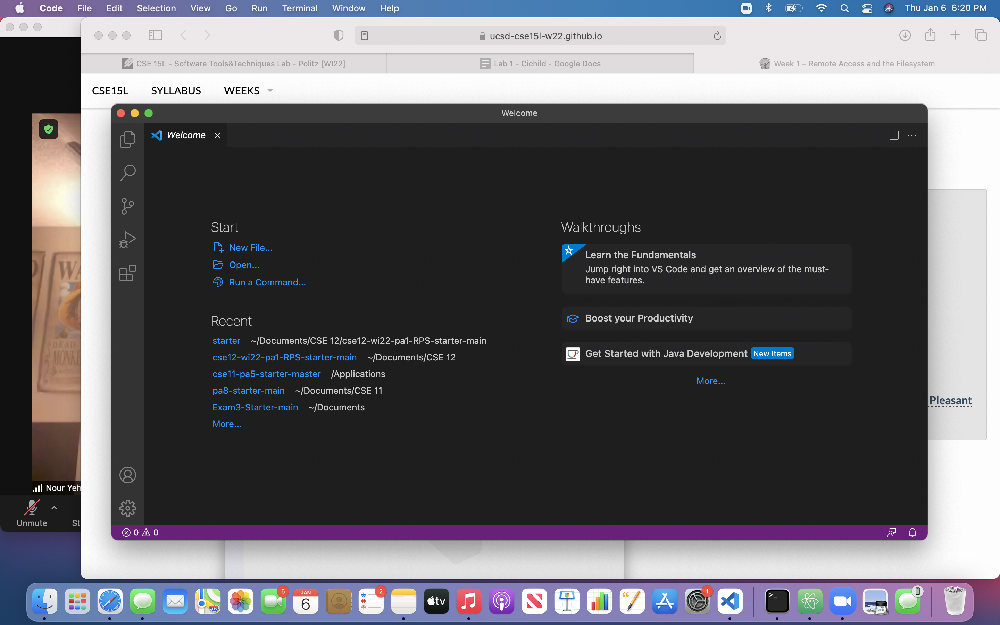
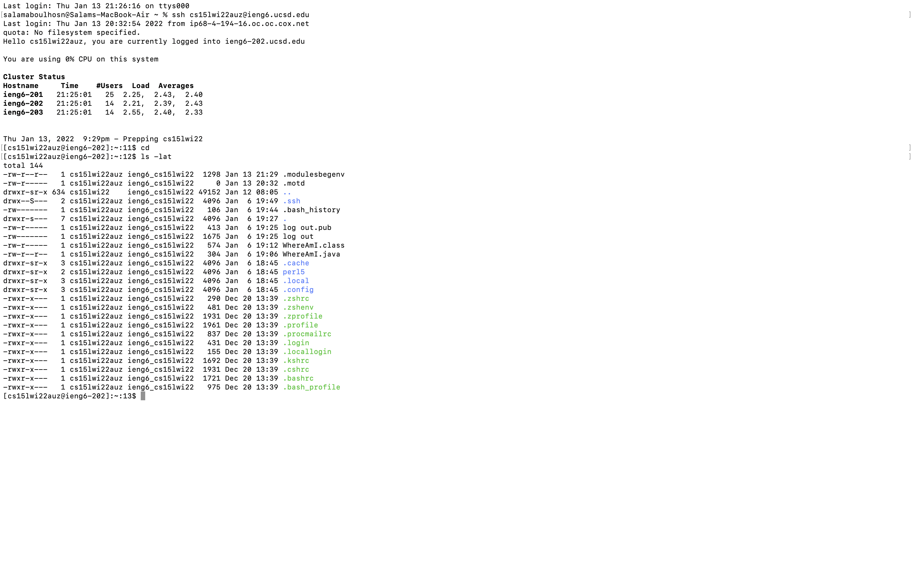
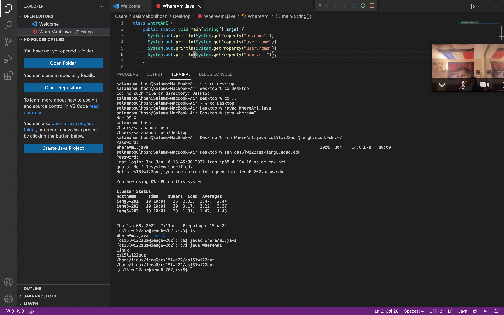
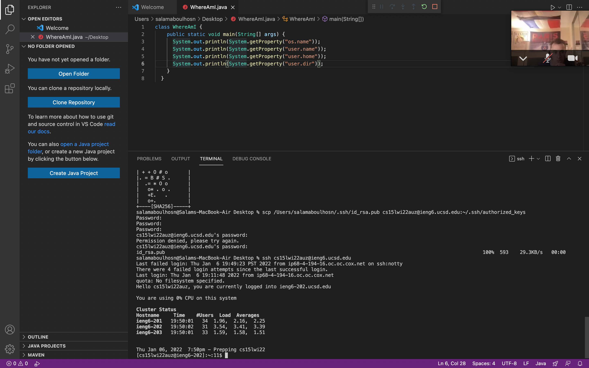
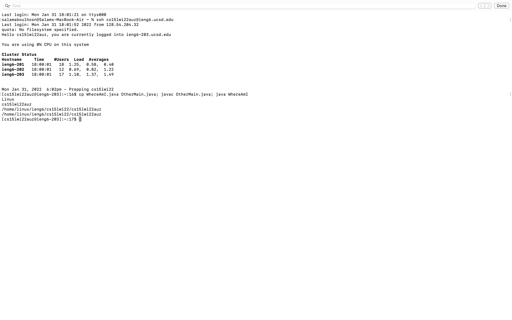

# Installing VScode

I went to this [website](https://code.visualstudio.com/download) and clicked on the blue download button for Mac OS. This installed the Visual Studio Code and then I opened it in my files in order to run it.

# Remotely Connecting

In order to remotely connect you must use the ssh command followed by the server address. For example my command was ssh cs15lwi22auz@ieng6.ucsd.edu. After doing the ssh command an option to  put in your password should appear. Type in your password and now your terminal will be connected to the server.

# Trying Some Commands
**Example of `ls -lat` command**
The command I used was `ls -lat`. The `ls -lat` command allows you to list all files or directories in the current directory by default. In order to use this command or any other command you open your terminal, type them in, and click enter. 
# Moving Files with scp

The scp command coppies files between a local and a remote system and is used to transfer data. In this case we ran the command: scp WhereAmI.java cs15lwi22zz@ieng6.ucsd.edu:\~/ As we can see here the commmand is scp (java file name) with the server address (cs15lwi22auz@ieng6.ucsd.edu) following with :\~/ This allowed us to copy a file from our computer to a remote computer. 
# Setting an SSH Key

Instead of having to type in your password every time you log in we can create an ssh key. Type in the command ssh-keygen. This command creates a public and private key. You have to copy public key to a specific location on the server and copy the private key to a location on the client. Copy the public key onto the .ssh directory and as a result you can run the ssh or scp command from your client to the server without entering your password. My command was $ scp /Users/salamaboulhosn/.ssh/id_rsa.pub cs15lwi22auz@ieng6.ucsd.edu:~/.ssh/authorized_keys
# Optimizing Remote Running

Typing out all of these commmands would take around 100 to 150 keystrokes if you type them one at a time. You can optimize run time speed by using the up arrow for each command in order to run these 4 commands which would reduce the keystrokes to around 20 to 25. In addition you can use semi colons in order to type multiple commands in one line. Which would allow you to only have to click the up arrow one time in order to run all 4 commands.
