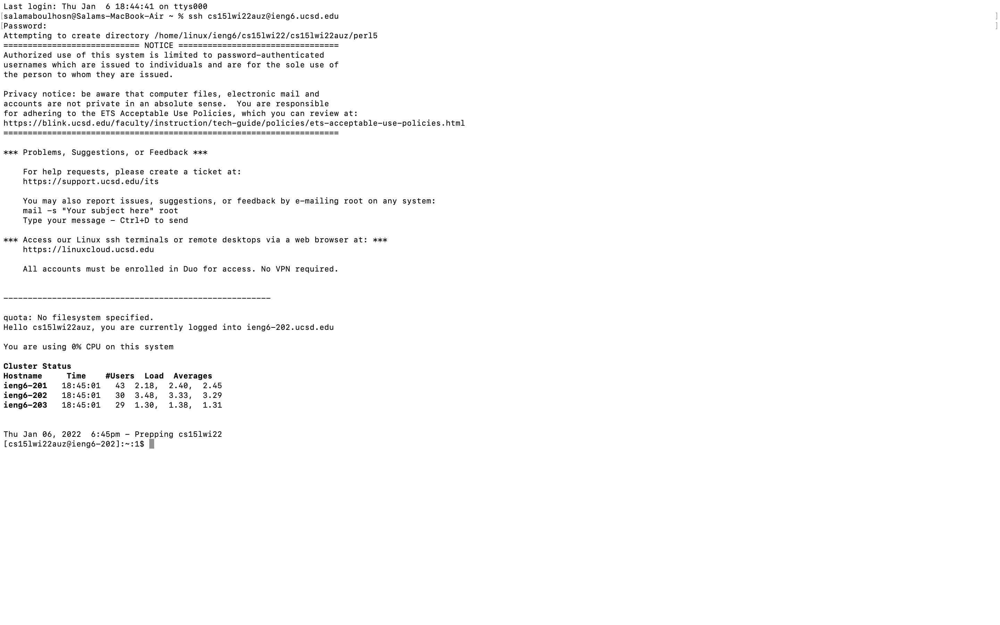
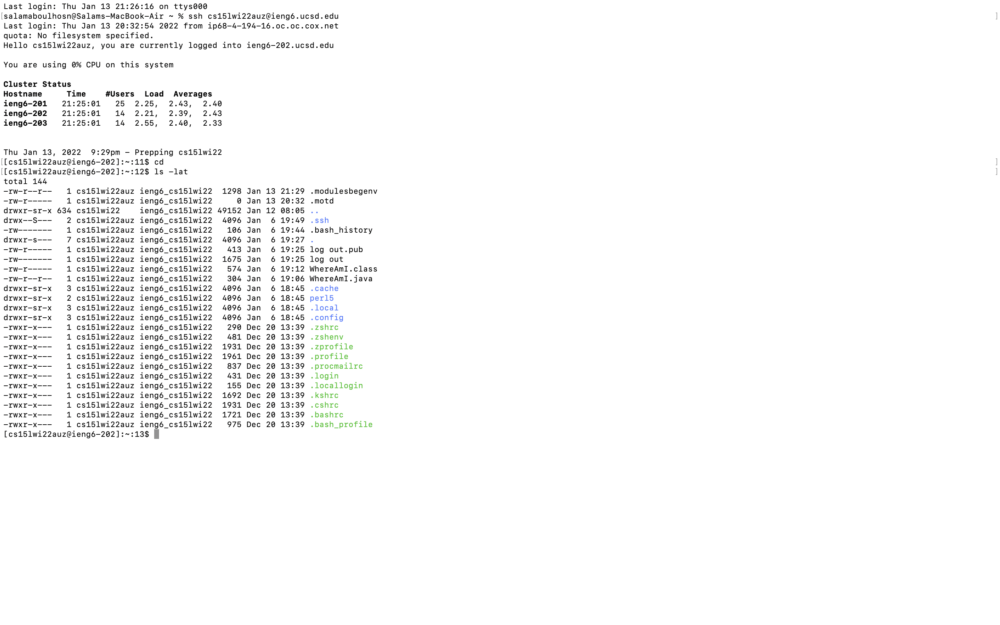

# Installing VScode

I went to this [website](https://code.visualstudio.com/download) and clicked on the blue download button for Mac OS. This installed the Visual Studio Code and then I opened it in my files in order to run it.

# Remotely Connecting

In order to remotely connect you must use the ssh command followed by the server address. For example mine was (cs15lwi22auz@ieng6.ucsd.edu). After doing the ssh command you put in your password and now your terminal will be connected to the server.

# Trying Some Commands

The commands I used were cd and ls -lat. The cd command stands for change directory and changes the current working directory in various operating systems. 
The ls -lat command is used to list files. In order to use these command you open your terminal and type them. 
# Moving Files with scp

# Setting an SSH Key

# Optimizing Remote Running
