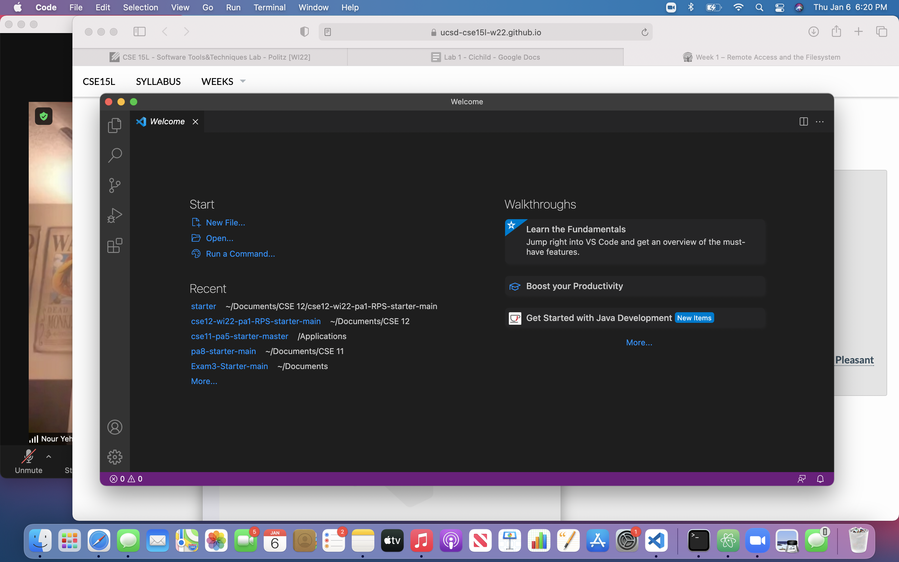
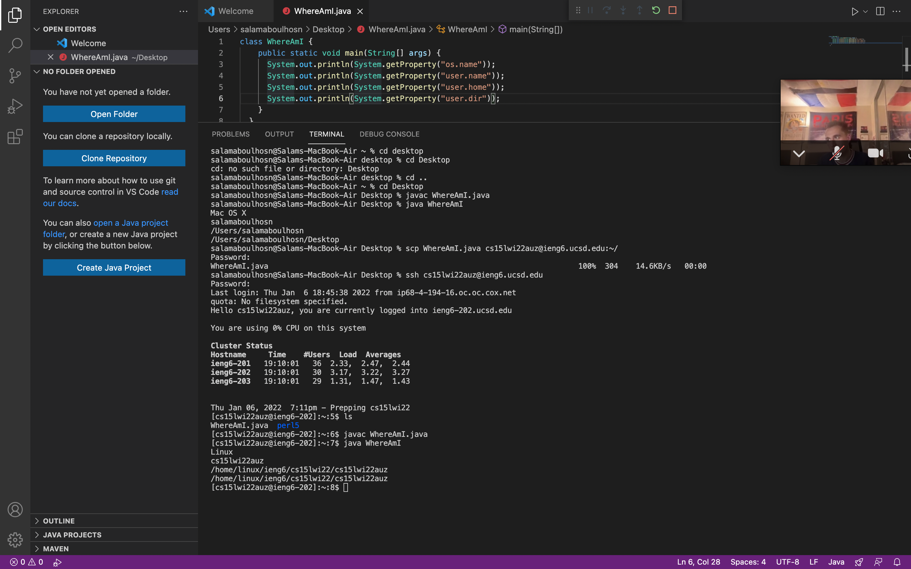

# Installing VScode

I went to this [website](https://code.visualstudio.com/download) and clicked on the blue download button for Mac OS. This installed the Visual Studio Code and then I opened it in my files in order to run it.

# Remotely Connecting

In order to remotely connect you must use the ssh command followed by the server address. For example mine was (cs15lwi22auz@ieng6.ucsd.edu). After doing the ssh command you put in your password and now your terminal will be connected to the server.

# Trying Some Commands
**Example of ls -lat command**
The command I used was ls -lat. The ls -lat command allows you to list all files or directories in the current directory by default. In order to use this command you open your terminal and type them. 
# Moving Files with scp

The scp command coppies files between a local and a remote system and is used to transfer data. In this case we ran the command: scp WhereAmI.java cs15lwi22zz@ieng6.ucsd.edu:~/ As we can see here the commmand is scp (java file name) with the server address (cs15lwi22auz@ieng6.ucsd.edu) following with :~/ This allowed us to copy a file from our computer to a remote computer. 
# Setting an SSH Key

Instead of having to type in your password every time you log in we can create an ssh key. Type in the command ssh-keygen. This command create a public and private key. The public key is sent to a location on the server while the private key is sent to a location on the client. 
# Optimizing Remote Running

In order to optimize runnning the user is allowed to use semi colons in order to type multiple commands in one line. With semi colons after every command, you can type the commands in one line instead of typing them each seperately and clicking enter.
